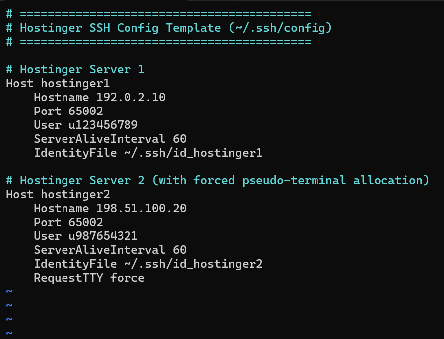

# Hostinger & Cloud Linux SSH Workflow Toolkit

A practical guide and reference template for creating Ed25519 SSH keys, configuring `~/.ssh/config` profiles, and writing shell aliases to instantly jump into remote server project directories.

---

## 1. Generate an Ed25519 SSH Key Pair

Run the following command in your local terminal:

ssh-keygen -t ed25519 -f ~/.ssh/id_hostinger1 -C "hostinger1"

- `-t ed25519`: Modern, secure elliptic curve algorithm.
- `-f ~/.ssh/id_hostinger1`: Custom output file name.
- `-C "hostinger1"`: Identifying comment label.

---

## 2. Copy the Public Key

Display and copy the contents of the generated `.pub` file:

cat ~/.ssh/id_hostinger1.pub

Copy the entire output starting with `ssh-ed25519 ...`.

---

## 3. Add Key to Hostinger (hPanel)

1. Log in to **Hostinger** and select your hosting plan.
2. In the sidebar, navigate to **Advanced** → **SSH Access**.
3. Under **SSH Keys**, click **Add SSH Key**.
4. Enter a name (e.g., `hostinger1`) and paste the public key into the field.
5. Click **Add** and ensure SSH access is **Enabled**.

---

## 4. Configure `~/.ssh/config`

Instead of typing `ssh -p 65002 u123456789@192.0.2.10` manually, configure an alias in `~/.ssh/config`.

Edit the file:

nano ~/.ssh/config

Add your host details:

Host hostinger1
	Hostname 192.0.2.10	
	Port 65002
	User u123456789
	ServerAliveInterval 60
	IdentityFile ~/.ssh/id_hostinger1

Host hostinger2
    Hostname 198.51.100.20
    Port 65002
    User u987654321
    ServerAliveInterval 60
    IdentityFile ~/.ssh/id_hostinger2
    RequestTTY force

Lock down permissions:

chmod 600 ~/.ssh/config

Connect directly:

ssh hostinger1

---

## 5. Shell Aliases & Direct Directory Jumping

Add custom aliases to your `~/.bashrc` (or `~/.zshrc`) to connect directly into specific website directories on your server:

# Direct Server Access
alias ssh-hostinger1="ssh hostinger1"
alias ssh-hostinger2="ssh hostinger2"

# Direct-to-Directory Project Navigation (Hostinger 1)
alias ssh-michaelnnah='ssh -t hostinger1 "cd ~/domains/[michaelnnah.com/public_html](https://michaelnnah.com/public_html) && exec \$SHELL -l"'

# Direct-to-Directory Project Navigation (Hostinger 2)
alias ssh-zanywholesaleshub='ssh -t hostinger2 "cd ~/domains/[zanywholesaleshub.com/public_html](https://zanywholesaleshub.com/public_html) && exec \$SHELL -l"'

Apply the changes:

source ~/.bashrc

---

## Permissions Checklist

If you encounter `Permission denied (publickey)`:

chmod 700 ~/.ssh
chmod 600 ~/.ssh/id_hostinger*
chmod 644 ~/.ssh/id_hostinger*.pub
chmod 600 ~/.ssh/config

---

## 6. Fast File Sync with Rsync

Because your `~/.ssh/config` is configured, `rsync` can leverage your existing host aliases without needing manual flags for ports, keys, or usernames.

### Download files from Hostinger to Local Machine

### Upload local files/directory to Hostinger

rsync -avzP --exclude='.git*' ./dist/ hostinger1:~/domains/michaelnnah.com/public_html/

**Flag Breakdown:**
- `-a` (Archive): Preserves file permissions, timestamps, symlinks, and directory structures.
- `-v` (Verbose): Shows real-time transfer progress.
- `-z` (Compress): Compresses file data during transfer to speed up execution over the network.
- `-P` (Progress & Partial): Displays a progress bar and allows resuming interrupted transfers.
- `--exclude`: Prevents syncing local Git repos, build files, or node modules.

